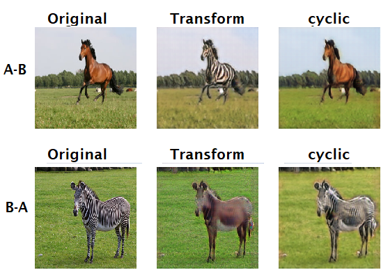

# Study of Cycle-consistent Generative Adversarial Networks (CycleGANs) for face aging
The repo refers to the official open source of paper [Cycle-consistent Generative Adversarial Networks (CycleGANs)] and other related CycleGANs source codes by Keras Framework.

As a source of research and study for dissertation, firstly, quick implementation in Google Colab (refer to "CycleGAN_v1"), and a comperhasive source code including training, testing and custom parameters setting in "CycleGAN_v2"
"FaceAgeing_CycleGANs_Google_Colab.ipynb" is a experimental record on teh Google Colab as backup.
Please follow the instructions to prepare and run the programme.
## 1. Install Keras-contrib 3nd package for instance normalization.
``` 
*shell

 pip install git+https://www.github.com/keras-team/keras-contrib.git

 ```
 
## 2. Training

1) Programme CycleGAN_v1
```
* Run the scripts without custom parameters

  cd CycleGAN_v1
  python faceaging_cyclegan.py
```

2) Programme CycleGAN_v2

```
* Run the scripts with custom parameters.

  cd CycleGAN_v2 
  python Main.py \
      --is_train True \
	  --pre-trained_model None \
	  --trainA TrainA_11sto20 \
	  --trainB TrainB_50sto70 \
	  --root_path ../../DATA/CycleGANs_Paired_TrainingSet \ #training set path
	  --path_testA ./test/your_testA_jpg \ #generating the result for each epoch
      --path_testB ./test/your_testB_jpg \
```
**NOTE**: During the training process, the "save_model", "cycGAN_G_loss", "images" will be created automatically. 
 - "save_model": save trained models and corresponding their weights (two discrimator models, two genderator models, one combined models)
 - "cycGAN_G_loss": save loss values by TensorBroad.
 - "images": save the test images using the intermediate trained model and csv file for combined disscrimator fake and real loss (D_A and D_B loss). 

## 3. Test 
```
    python main.py --is_train False \ 
```
**NOTE**:
   the test result will be saved into './test' folder.

## 4. Experiment result
 - Training horsetozerbar and human faces results:
<p align="center">
  
  
</p>

## Reference
- [CycleGANs tutorial]
   https://hardikbansal.github.io/CycleGANBlog/
- [CycleGANs Offical Open source code, TensorFlow] 
   https://github.com/junyanz/CycleGAN.git
- [CycleGANs Offical Open source code, Keras]
   https://github.com/simontomaskarlsson/CycleGAN-Keras.git
- [other references for code explemention]
 --https://github.com/eriklindernoren/Keras-GAN.git
 --https://github.com/sungnam0/Face-Aging-with-CycleGAN.git
