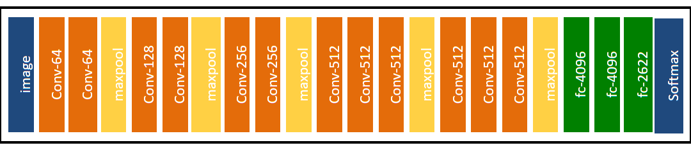
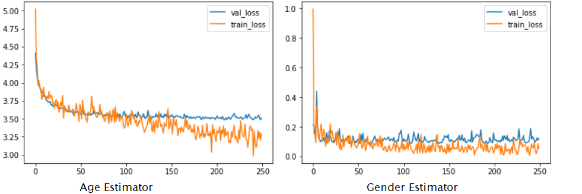

# Age and Gender Estimators

This programme is developed for evaluation of generated face images, it used Oxford VGGFace pre-trained model (Implementation using Keras Functional Framework v2+)

The model structure is the same as DEX Gender and Age estimators based on VGG16 and implemented by Keras Framework v2.2.4.
<p align="center">
   
 <text>
  [Deep Face Recognition](http://www.robots.ox.ac.uk/~vgg/publications/2015/Parkhi15/poster.pdf) </text>
</p>

Please follow the instructions to prepare and run the programme.

1. Download training dataset (IMDB-WIKI) and Load Oxford VGGFace pre-train model 

```
  !bash data_pretrainedModel_download.sh 
```

2. Training from scratch

```
   python Main.py --train_model age #value: [age or gender], choose which type of model for training
```

3. Test
* Download age and gender pre-trained models [age_gender_estimators_pretrained.zip] in the "pretrained" folder. 
Link: https://drive.google.com/drive/folders/1AN4V-cdq0pIUXtXyWBtIcveJI12WZnlh?usp=sharing/age_gender_estimators_pretrained.zip

```
  python test.py --image_dir ./test #test image path \
      --output_dir ./output #show the results
```
The age and gender labels will be a part of new image names in the output folder.
e.g. 017A29.JPG -> gender_M_age_31_017A29.JPG

4. Training result and evaluation
It shows training loss and validation loss for age and gender estimators.
<p align="center">
    
</p>

- Gender model
Accuracy: 97%
Confusion Matrix \
       [[1781,  146],\
       [55, 4660]]
- Age model
Mean Absolute Error (MEA) is a useful evaluation parameter as after training the accuracy is low 5.5%, as I need to transfer the classification to regression by multiply by age range[0,100]. 
MEA is 6.3, which means the error around (+-)6.3 

The detail and process result and evaluation are implemented on Google Colab in the folder: <b>ExperimentColab_Age_Gender_Estimator</b>
## Reference
1. [IMDB-WIKI dataset](https://data.vision.ee.ethz.ch/cvl/rrothe/imdb-wiki/)
2. [Deep expectation of real and apparent age from a single image without facial landmarks](https://www.vision.ee.ethz.ch/publications/papers/proceedings/eth_biwi_01229.pdf)
3. [Source Coding reference](https://sefiks.com/2019/02/13/apparent-age-and-gender-prediction-in-keras/)
