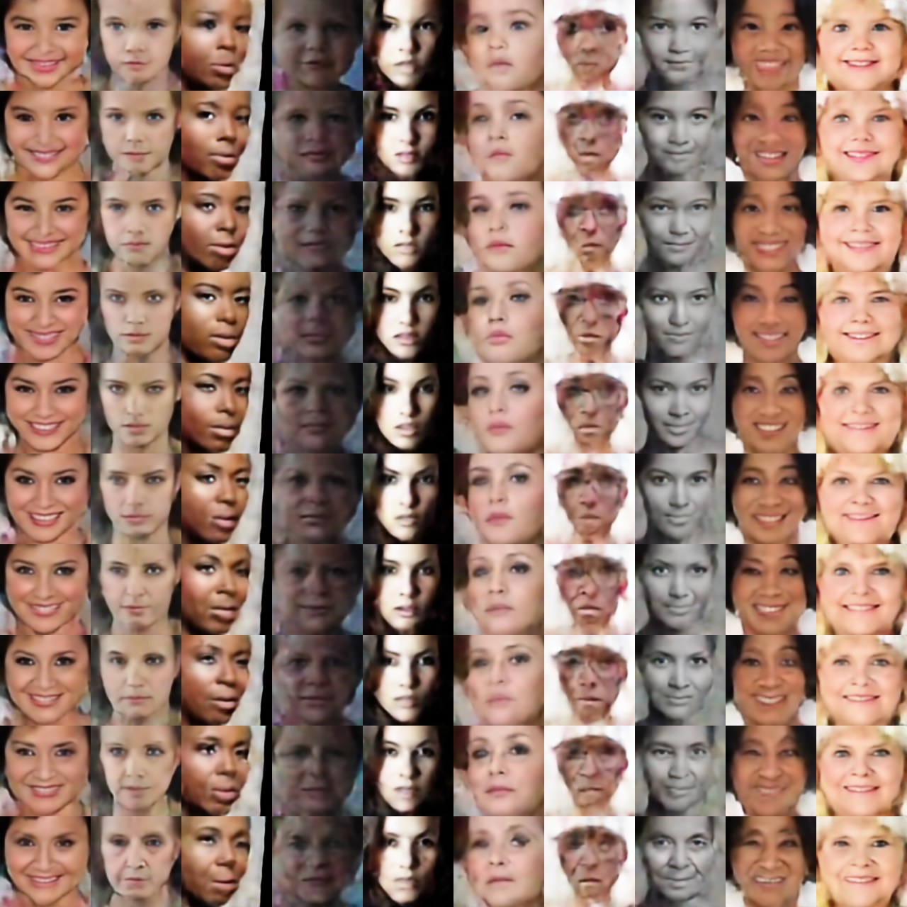
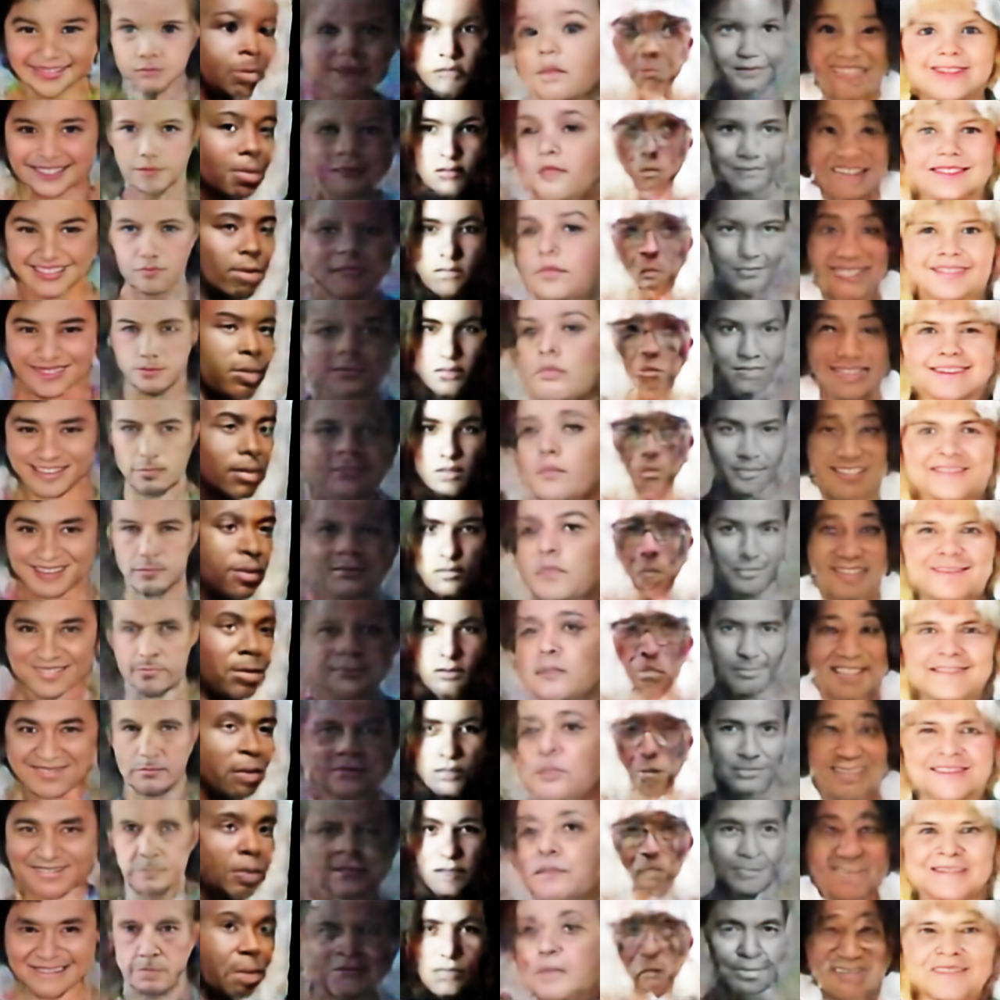

# Study of Age Progression/Regression by Conditional Adversarial Autoencoder (CAAE)
The repo refers to the official open source of paper [Age Progression/Regression by Conditional Adversarial Autoencoder]

As a source of research and study for the research project, some parts of codes are modified and add log file instead of print, finally the code has ungraded to Tensorflow 1.14.1.

Please follow the instructions to prepare and run the programme.

** Precondition for data:
  - The image file name should have age label and gender label e.g.: "14_0_4_Aaron_Johnson_0001.jpg": 14 is age and 0 is gender (0: male, 1: female), and they both are separated by symbol '_'.


## 1. Download 
1) Pre-trained models and loss result into "save" folder.
link: https://drive.google.com/drive/folders/1AN4V-cdq0pIUXtXyWBtIcveJI12WZnlh?usp=sharing/CAAE_pretrainedmodel_summary.zip [CAAE_pretrainedmodel_summary.zip]
2) The initial model and download into "init_model", and please choose "extract here" to unzip directly without subfolder.
link: https://drive.google.com/drive/folders/1AN4V-cdq0pIUXtXyWBtIcveJI12WZnlh?usp=sharing/CAAE_init_model.zip [CAAE_init_model.zip]

## 2. Training

1) Using the initial model from CAAE the paper's author

```
* Run the scripts with custom parameters.

  python main.py
    --is_train True
    --epoch 50
    --dataset ../DATA/TrainingSet_CACD2000
    --savedir save
    --testdir test #when training, the test images will created in this dir each epoch.
    --use_trained_model False
    --use_init_model True
```

2) Training from scratch

```
* Run the scripts with custom parameters.
* output.log file will be created automatically to check the detail information during the training process.
  python main.py \
    --is_train True \
    --epoch 50 \
    --dataset ../DATA/TrainingSet_CACD2000 \
    --savedir save \
    --use_trained_model False \
    --use_init_model False
```
**NOTE**: During the training process, the "checkpoint", "samples", "summary" and "test" folders will be created in the "save" folder automatically. 
 - "checkpoints": save trained model.
 - "samples": save the test images( 100 images in a one png files (10*10), and the top 10 images on the first rom in one sample images will be fed into intermediate trained model. 
 - "summary": save loss values by TensorBroad.
 - "test": save the generated results each epoch.

## 3. Test 
```
    python main.py \
    --is_train False \
    --testdir test_image_dir \ # default: test
    --savedir save 
```
**NOTE**:
   the test result will be saved into './save/test' folders, which are two png images by genders. "test_as_female.png" and "test_as_male.png"

## 4. Experiment result
 - Female (Left) and Male (Right) results:
<p align="center">
  |||
  
</p>

## 5. Files
* [`ops.py`](ops.py): Build layers, such as convolution, fully connection, activation function(Leaky ReLU), and images operation (load and save images).
* [`FaceAging.py`](FaceAging.py): a class, to build a model by calling 'ops.py'
* [`main.py`](main.py): start the programme to run `FaceAging.py`.

## Reference
- https://github.com/ZZUTK/Face-Aging-CAAE.git
- http://web.eecs.utk.edu/~zzhang61/docs/papers/2017_CVPR_Age.pdf
