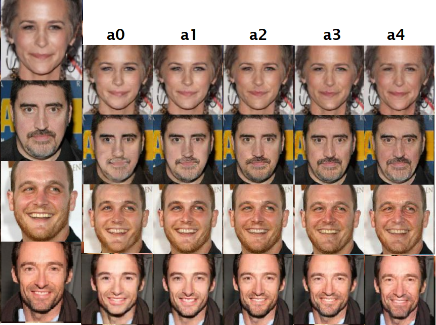

# Study of Face Aging with Identity-Preserved Conditional Generative Adversarial Networks (IPCGANs)
The repo refers to the official open source of paper [Face Aging with Identity-Preserved Conditional Generative Adversarial Networks]

While their instruction is not comprehensive leading to it is hard to run the code directly following their instruction. In order to run the code smoothly for research and study, some parts of codes are modified, and add three tools for generating source files, finally the code has ungraded to Tensorflow 1.14.1.

Please follow the instructions to prepare and run the programme.

** Precondition for data:
  - The image file name should have age label e.g.: "14_0_4_Aaron_Johnson_0001.jpg": 14 is age and should include symbol '_'.


## 1. Prepare source files 
There are three tool files (path: ./tools/file/):
- getsourcefile.py
- tools_get_testfiles.py
- tools_get_trainfiles.py
1) Update sourcefile.txt (path: ./tools/)
``` 
   *Run the script with input sources path
   python getsourcefile.py ../DATA/TrainingSet_CACD2000
```
2) Update train_age_group_xxx.txt in folder "train_data"
``` 
   *Run the script with input sources path
   python tools_get_trainfiles.py ../DATA/TrainingSet_CACD2000
```
3) Update test_age_group_xxx.txt in folder "test_data"
``` 
   *Run the script with test images path
   python tools_get_trainfiles.py ../DATA/TestSet_FGNET
```
4) Optional:
train_label_pair.txt is two columns which are random numbers between 0 to 4 (five age groups), and the two numbers should be different each row.

## 2. Download four pre-train models into "checkpoints" folder.
link: https://drive.google.com/drive/folders/1AN4V-cdq0pIUXtXyWBtIcveJI12WZnlh?usp=sharing [IPCGANs_pre_trained_Alex.zip, IPCGANs_PretrainedModels.zip]
- 0_conv5_lsgan_transfer_g75_0.5f-4_a30: pre-trained model from paper author.
- conv5_lsgan_transfer: pre-trained model from this dissertation.
- pre_trained: age classification and Alexnet model 

## 3. Test
1) Test using the pre-trained model from the paper's Author
```
    python pre_trainedmodel_test.py \
         --test_data_dir=../DATA/TestSet_FGNET
```
2) Test using custom pre-trained model from this experiment
```
    python custom_test.py \
         --custom_model_number=199999 \
         --test_data_dir=../DATA/TestSet_FGNET
```

## 4. Training from scratch
```
* Run the scripts with default hyperparameters values
python age_lsgan_transfer.py \
  --gan_loss_weight=75 \
  --fea_loss_weight=0.5e-4 \
  --age_loss_weight=30 \
  --fea_layer_name=conv5 \
  --learning_rate=1e-3 \
  --batch_size=32 \
  --image_size=128 \
  --max_steps=500000
  --root_folder=../DATA/TrainingSet_CACD2000
```
## 5. Experiment result
<p align="center">
  
</p>

## Reference
- [IPCGANs open source code](https://github.com/dawei6875797/Face-Aging-with-Identity-Preserved-Conditional-Generative-Adversarial-Networks.git)
- [IPCGANs paper](http://openaccess.thecvf.com/content_cvpr_2018/papers/Wang_Face_Aging_With_CVPR_2018_paper.pdf)
