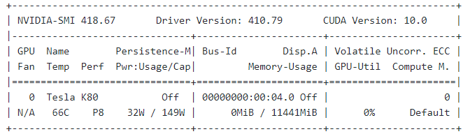
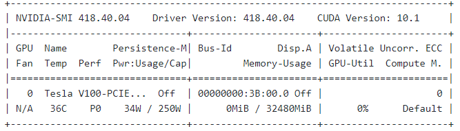

## Final Year Research Project (2019/2020):
### Topic: In-depth Study of Generative Adversarial Networks for Face Aging ###

##### Author: Na Li
##### Student Number: 17210325 
##### Supervisor: Guenole Silvestre 
##### UCD School of Computer Science
##### University Colege Dublin 
##################################### 

The aim of the research project is to study and analysis three exits architectures based on Generative Adversarial Networks (GANs) for face aging tasks in Deep Learning, IPCGANs and CAAE and CycleGANs. The gender and age estimators for evaluating and verifying the synthetic faces which are generated by the three models.

The repo includes all programmes and corresponding to comprehensive structures for running programmes.
The overview instruction below,
1. Environment setup for three types of GANs programmes and age/gender estimators

	 (1) Training and Testing Environment
	  - Google Colab notebook:
	     - GPU: Tesla K80 12GB
	  - GPU on Sonic High-Performance Computer (HPC) Cluster of UCD campus.
	     - GPU: Tesla V100-PCIE-32GB
<p align="center">
   
    
</p>
	 (2) Install 3rd-package dependencies of python (No need to install on Google Colab)
	 
    In Snoic HPC cluster platform, a virtual environment TEMPhas to be set up for running programmes by anaconda.
    "myenv" is the name of environment, the sample sbatch (.sh) script files in /sbatchs folder.
```    
    $ cd /opt/software/anaconda/3.5.2/bin
    $ source activate
    $ conda create -n myenv python=3.6.8
    $ conda activate myenv
    
    $ sbatch --partition=csgpu gpujob.sh  #run one job command line
```
    
- 3rd-package dependencies of python=3.6.8

```
     pip install tensorflow-gpu==1.14.0
     pip install scipy==1.0.0
     pip install opencv-python==3.3.0.10
     pip install imageio
     pip install scikit-image
     pip install Pillow==5.1.0
     pip install pandas
     pip install -U scikit-learn
     pip install keras==2.2.4
     pip install numpy 

 ```

- Other Libraries (both has pre-installed on Sonic HPC cluster service )
   
   CUDA 10.0 \
   Cudnn 7.0
   
2. Dataset download 
All datasets are shared on Google Drive.

    Link:  https://drive.google.com/drive/folders/1AN4V-cdq0pIUXtXyWBtIcveJI12WZnlh?usp=sharing/DATA 
    [TrainingSet_CACD2000.zip, ValidationSet_UTKFace.zip, CycleGANs_Paired_TrainingSet, TestSet_FGNET.zip]

3. Project Structures 
        
	- IPCGANs_Face_Aging_5AgeGroups
	- Face_Aging_CAAE_10age
	- CycleGANs
	   - CycleGANs_v1
	   - CycleGANs_v2
	- Age_Gender_Estimators_Experiment_G-Colab
	- Face_Age_Gender_Estimator	
	- DataProcess_FaceAlignment
	- DATA
	   - CycleGANs_Paired_TrainingSet
	   - TestSet_FGNET
	   - TrainingSet_CACD2000
	   - ValidationSet_UTKFace

4. Miscellaneous
   
   - If the jupyter notebooks (.ipynb) on GitHub cannot load directly, please copy the path to https://nbviewer.jupyter.org/.
   - If the training process is not successful in a programme, please double check the training set path you provided.
